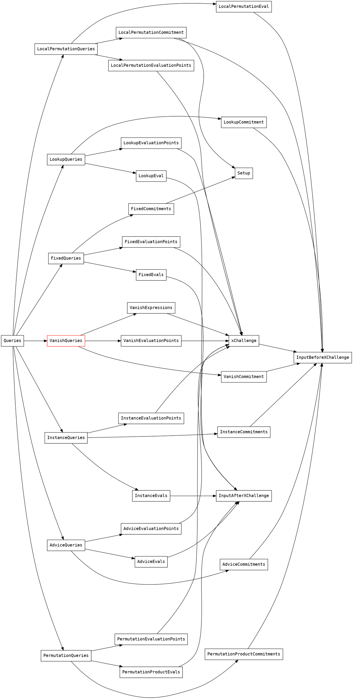

# Halo2 Circuit Aggregation

## 1 Schema:

### 1.1 Query with commits and evaluations.

Given polynomial $p$, we denote $p(X)$ (captial X) to be the polynomial itself, [p] to be the commit of $p$ and $p(v)$ to be the evaluation of $p$ at point $v$. A Evaluation Query of polynomial p is a tuple $(z,p(z),[p])$. For all queries, we group them into groups so that every query in the same group are evaluated at the same point $z_i$. It follows that the main body of the verifying process is to calculate Queries $Q(z,p(z), [p])$ for various $p$ and then group them as above and then figure out the final multiopen formula.

Thus a proof and verification **schema** can be defined as a large multi-open of queries.

For example we can write down the verifying schema of standard plonk in some ast in the following AST:

```
        let r = eval!(a) * eval!(b) * commit!(qm) + eval!(a) * commit!(ql)
            + eval!(b) * commit!(qr) + eval!(c) * commit!(qo) + pi_xi + commit!(qc)
            + scalar!(self.alpha) * (
                  (eval!(a) + (scalar!(self.beta) * xi.clone()) + scalar!(self.gamma))
                * (eval!(b) + (scalar!(self.beta)
                        * scalar!(self.common.k[0]) * xi.clone()) + scalar!(self.gamma))
                * (eval!(c) + (scalar!(self.beta)
                        * scalar!(self.common.k[1]) * xi) + scalar!(self.gamma))
                * commit!(z)
                + (eval!(a) + (scalar!(self.beta) * eval!(sigma1))
                    + scalar!(self.gamma))
                * (eval!(b) + (scalar!(self.beta) * eval!(sigma2))
                    + scalar!(self.gamma))
                * (eval!(c) + (scalar!(self.beta) * commit!(sigma3))
                    + scalar!(self.gamma))
                * eval!(zxi)
              )
            + scalar!(self.alpha) * scalar!(self.alpha)
                * l1_xi * (commit!(z) + scalar!(neg_one))
            + zh_xi * (commit!(tl) + xi_n * commit!(tm) + xi_2n * commit!(th))
            + scalar!(self.v) * (
                commit!(a) + scalar!(self.v) * (
                    commit!(b) + scalar!(self.v) * (
                        commit!(c) + scalar!(self.v) * (
                            commit!(sigma1) + scalar!(self.v) * commit!(sigma2)
                        )
                    )
                )
            )
            + scalar!(self.v) * (
                eval!(a) + scalar!(self.v) * (
                    eval!(b) + scalar!(self.v) * (
                        eval!(c) + scalar!(self.v) * (
                            eval!(sigma1) + scalar!(self.v) * eval!(sigma2)
                        )
                    )
                )
            );
        Ok(EvaluationProof {s:r, point:self.xi.clone(), w: self.commits.w_z})
```

### 1.2 Arithment within special context:
This document is a design brief of how to generate plonk verifying code and plonk verification circuit (mainly for proof aggregation) at the same time. The main idea is to abstract a trait of group and field algebra for both code and circuit (We believe there are various benefits to do so both for maintenance and for future updating of the proof schema for the verifying circuit). To achieve this, we notice that in verifying code generation, arithment are performed with no side effects but when using fp over fr arithment gates, integer and pointer arithment will have side effects(change the state of the gate).

Thus our arithment trait is a trait that will assume side effects do exists during the arithment of scalar fields, base fields and point groups of ecc.

For example, arithment like "a + b * p" needs to be performed under a arith_in_ctx macro looks like
```
arith_in_ctx!([ctx], a + b * p)
```

Moreover the context has to components, one for scalar arithment and the other for elliptic arithment.

```
pub trait ArithEccChip:
    ArithCommonChip<Value = Self::Point, AssignedValue = Self::AssignedPoint>
{

    type ScalarChip: ArithFieldChip<
        Context = Self::Context,
        Field = Self::Scalar,
        AssignedField = Self::AssignedScalar,
        Error = Self::Error,
    >;
    type NativeChip: ArithFieldChip<
        Context = Self::Context,
        Field = Self::Native,
        AssignedField = Self::AssignedNative,
        Error = Self::Error,
    >;

```

### 1.3 Different context for schema:
There are three computation context involved in the codebase:
*    Pure calculation context
*    Halo2 circuit context
*    Solidity runtime context

When basic arithment are implemented for all these three context, we implement the eval trait of **schema** to evaluate the result of the mutl_exp

```
impl<P: Clone, S: Clone> EvaluationQuerySchema<P, S> {
    pub fn eval<
        Scalar: FieldExt,
        A: ArithEccChip<AssignedPoint = P, AssignedScalar = S, Scalar = Scalar>,
    >(
        self,
        ctx: &mut A::Context,
        schip: &A::ScalarChip,
        pchip: &A,
        one: &A::AssignedScalar,
    ) -> Result<(A::AssignedPoint, Option<A::AssignedScalar>), A::Error> {


```

Based on this trait, we will be able to implement some universal code base for verifying code (executable files to generate witness), verifying circuit(can be used for proof aggregator) and solidity code.


then by providing different trait implementation of scalar, basefield and ecc points, we can use the same code base for both executable verifier and verifying circuit.

# 2. Proof Aggregation Approach

## 2.1. Top level sketch:
Suppose that verifying a single proof of a target circuit $C$ is split into three phases:
1. Query Constructing (read from transcript)
2. Construct schema.
3. Evaluate the multiopen result of $W_x$ and $W_e$ such that
  $$(W_x[i], x) = (W_e[i], 1)$$
4. Check the above pair.

Then by the linearity of pairing, we can construct random linear combination of multiple $W_x[i]$ $W_e[i]$ and check that:
  $$(\sum_i \lambda^{i-1}W_x[i], x) = (\sum_i \lambda^{i-1}W_e[i], 1)$$

Motivated by the above thoughts, we split the process of verifying into 4 stages
* 1. Argument Preparing
* 2. Query Constructing (read from transcript) for multiple proofs
* 3. Construct schema from queries of multiple proofs
* 4. Construct the schema using the linear combination of the schemas from multiple proofs.
* 4. Evaluate the multiopen result of the schema.

More precisely the top level pseudo code might look like the following

```
pub fn verify_aggregation_proofs_in_chip<
    E: MultiMillerLoop,
    A: ArithEccChip<
        Point = E::G1Affine,
        Scalar = <E::G1Affine as CurveAffine>::ScalarExt,
        Native = <E::G1Affine as CurveAffine>::ScalarExt,
    >,
    T: TranscriptRead<A>,
>(
    ctx: &mut A::Context,
    nchip: &A::NativeChip,
    schip: &A::ScalarChip,
    pchip: &A,
    mut circuits: Vec<CircuitProof<E, A, T>>,
    transcript: &mut T,
) -> Result<
    (
        A::AssignedPoint, // w_x
        A::AssignedPoint, // w_g
        Vec<A::AssignedScalar>, // plain assigned instance
        Vec<Vec<A::AssignedPoint>>, // advice commitments
    ),
    A::Error>
  {
    let mut plain_assigned_instances = vec![];
    let multiopen_proofs: Vec<Vec<(MultiOpenProof<A>, Vec<A::AssignedPoint>)>> = circuits
        .iter_mut()
        .map(|circuit_proof| {
            let r = circuit_proof
                .proofs
                .iter_mut()
                .map(|proof| {

                    ...

                    let (assigned_instances, assigned_instance_commitments) =
                        assign_instance_commitment(
                            ctx,
                            schip,
                            pchip,
                            &instances2[..],
                            circuit_proof.vk,
                            circuit_proof.params,
                        )?;

                    for assigned_instance in assigned_instances {
                        plain_assigned_instances.push(assigned_instance)
                    }

                    let (p, c) = verify_single_proof_no_eval()?;

                    Ok((p,c))
                })
                .collect();

            /* update aggregation challenge */
            for p in circuit_proof.proofs.iter_mut() {
                let scalar = p.transcript.squeeze_challenge_scalar(ctx, nchip, schip)?;
                transcript.common_scalar(ctx, nchip, schip, &scalar)?;
            }

            return r;
        })
        .collect()?;


    let aggregation_challenge = transcript.squeeze_challenge_scalar(ctx, nchip, schip)?;

    let mut acc: Option<MultiOpenProof<A>> = None;
    let mut commits: Vec<Vec<A::AssignedPoint>> = vec![];
    for (proof, c) in proofs.into_iter() {
        acc = match acc {
            None => Some(proof),
            Some(acc) => {
                Some(MultiOpenProof {
                    w_x: acc.w_x * scalar!(aggregation_challenge) + proof.w_x,
                    w_g: acc.w_g * scalar!(aggregation_challenge) + proof.w_g,
                })
            }
        };
        commits.push(c)
    }
    let aggregated_proof = acc.unwrap();

    evaluate_multiopen_proof::<E, A, T>(ctx, schip, pchip, aggregated_proof)
        .map(|pair| (pair.0, pair.1, plain_assigned_instances, commits))

```
## 2.2. Calculating the Queries:
Ingredients of queries are decoded from transcripts. We implement the following trait for each context of schema:

### Encode Trait
```
pub trait Encode<A: ArithEccChip> {
    fn encode_point(
        ctx: &mut A::Context,
        nchip: &A::NativeChip,
        schip: &A::ScalarChip,
        pchip: &A,
        v: &A::AssignedPoint,
    ) -> Result<Vec<A::AssignedNative>, A::Error>;
    fn encode_scalar(
        ctx: &mut A::Context,
        nchip: &A::NativeChip,
        schip: &A::ScalarChip,
        v: &A::AssignedScalar,
    ) -> Result<Vec<A::AssignedNative>, A::Error>;
    fn decode_scalar(
        ctx: &mut A::Context,
        nchip: &A::NativeChip,
        schip: &A::ScalarChip,
        v: &[A::AssignedNative],
    ) -> Result<A::AssignedScalar, A::Error>;
}
```

### Transcript Read Trait
```
pub trait TranscriptRead<A: ArithEccChip> {
    fn read_point(
        &mut self,
        ctx: &mut A::Context,
        nchip: &A::NativeChip,
        schip: &A::ScalarChip,
        pchip: &A,
    ) -> Result<A::AssignedPoint, A::Error>;
    fn read_scalar(
        &mut self,
        ctx: &mut A::Context,
        nchip: &A::NativeChip,
        schip: &A::ScalarChip,
    ) -> Result<A::AssignedScalar, A::Error>;

    fn read_constant_point(
        &mut self,
        ctx: &mut A::Context,
        nchip: &A::NativeChip,
        schip: &A::ScalarChip,
        pchip: &A,
    ) -> Result<A::AssignedPoint, A::Error>;
    fn read_constant_scalar(
        &mut self,
        ctx: &mut A::Context,
        nchip: &A::NativeChip,
        schip: &A::ScalarChip,
    ) -> Result<A::AssignedScalar, A::Error>;

    fn common_point(
        &mut self,
        ctx: &mut A::Context,
        nchip: &A::NativeChip,
        schip: &A::ScalarChip,
        pchip: &A,
        p: &A::AssignedPoint,
    ) -> Result<(), A::Error>;
    fn common_scalar(
        &mut self,
        ctx: &mut A::Context,
        nchip: &A::NativeChip,
        schip: &A::ScalarChip,
        s: &A::AssignedScalar,
    ) -> Result<(), A::Error>;

    fn squeeze_challenge_scalar(
        &mut self,
        ctx: &mut A::Context,
        nchip: &A::NativeChip,
        schip: &A::ScalarChip,
    ) -> Result<A::AssignedScalar, A::Error>;
}

```
## 2.3 Construct schemas
Schema is construct simply construct the multi-exp ast for queries:
```
    pub fn batch_multi_open_proofs(
        &self,
        ctx: &mut A::Context,
        schip: &A::ScalarChip,
    ) -> Result<MultiOpenProof<A>, A::Error> {
        let proofs = self.get_point_schemas(ctx, schip)?;

        let mut w_x = None;
        let mut w_g = None;

        for (i, p) in proofs.into_iter().enumerate() {
            let s = &p.s;
            let w = CommitQuery {
                key: format!("{}_w{}", self.key, i),
                commitment: Some(p.w.clone()),
                eval: None,
            };
            w_x = w_x.map_or(Some(commit!(w)), |w_x| {
                Some(scalar!(self.u) * w_x + commit!(w))
            });

            w_g = w_g.map_or(Some(scalar!(p.point) * commit!(w) + s.clone()), |w_g| {
                Some(scalar!(self.u) * w_g + scalar!(p.point) * commit!(w) + s.clone())
            });
        }

        Ok(MultiOpenProof {
            w_x: w_x.unwrap(),
            w_g: w_g.unwrap(),
        })
    }
```
Recall that at this stage no real calculation was performed but only schema (ast of mult-exp) is constructed.

## Evaluate multi-exp:
After multi-exp for all proofs are constructed, we construct the final ast for multi-exp as follows:
```
for (proof, c) in proofs.into_iter() {
    acc = match acc {
        None => Some(proof),
        Some(acc) => {
            Some(MultiOpenProof {
                w_x: acc.w_x * scalar!(aggregation_challenge) + proof.w_x,
                w_g: acc.w_g * scalar!(aggregation_challenge) + proof.w_g,
            })
        }
    };
    commits.push(c)
}
acc.unwrap();
```
And eventually, we can start calculating the final result by
```
evaluate_multiopen_proof::<E, A, T>(ctx, schip, pchip, aggregated_proof)
    .map(|pair| (pair.0, pair.1, plain_assigned_instances, commits))
```

# Circuit structure

## Base Arith Gate
```
#[derive(Clone, Debug)]
pub struct BaseGateConfig<const VAR_COLUMNS: usize, const MUL_COLUMNS: usize> {
    pub base: [Column<Advice>; VAR_COLUMNS],
    pub coeff: [Column<Fixed>; VAR_COLUMNS],
    pub mul_coeff: [Column<Fixed>; MUL_COLUMNS],
    pub next_coeff: Column<Fixed>,
    pub constant: Column<Fixed>,
}
```
## Transcript Chip
## Base field Arith Chip
## Ecc Arith Chip

# Future Work

1. Wider arith base gate
2. Multi-layer aggregator

# License

Licensed under either of

- Apache License, Version 2.0, ([LICENSE-APACHE](LICENSE-APACHE) or http://www.apache.org/licenses/LICENSE-2.0)
- MIT license ([LICENSE-MIT](LICENSE-MIT) or http://opensource.org/licenses/MIT)

at your option.

# Appendix
## Fp over fr materials
1. [Multiexp in TurboPlonk](https://docs.zkproof.org/pages/standards/accepted-workshop3/proposal-turbo_plonk.pdf)
2. [Aztec emulated field and group operations](https://hackmd.io/@arielg/B13JoihA8)
3. [Implementing ECC addition in orchard using Halo2 (Zcash)](https://zcash.github.io/orchard/design/circuit/gadgets/ecc/addition.html)
4. [Implementing Fp arithmetic in an Fq circuit (Zcash, R1CS)](https://github.com/zcash/zcash/issues/4093)
5. [Xjsnark paper for Long Integer Arithmetic (R1CS)](https://akosba.github.io/papers/xjsnark.pdf)

## Query layout:

